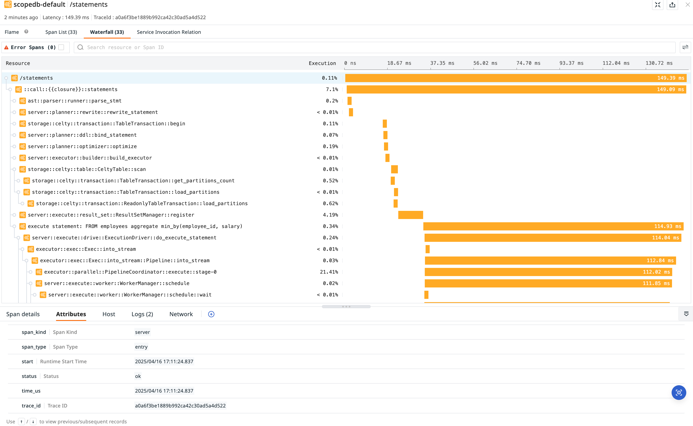
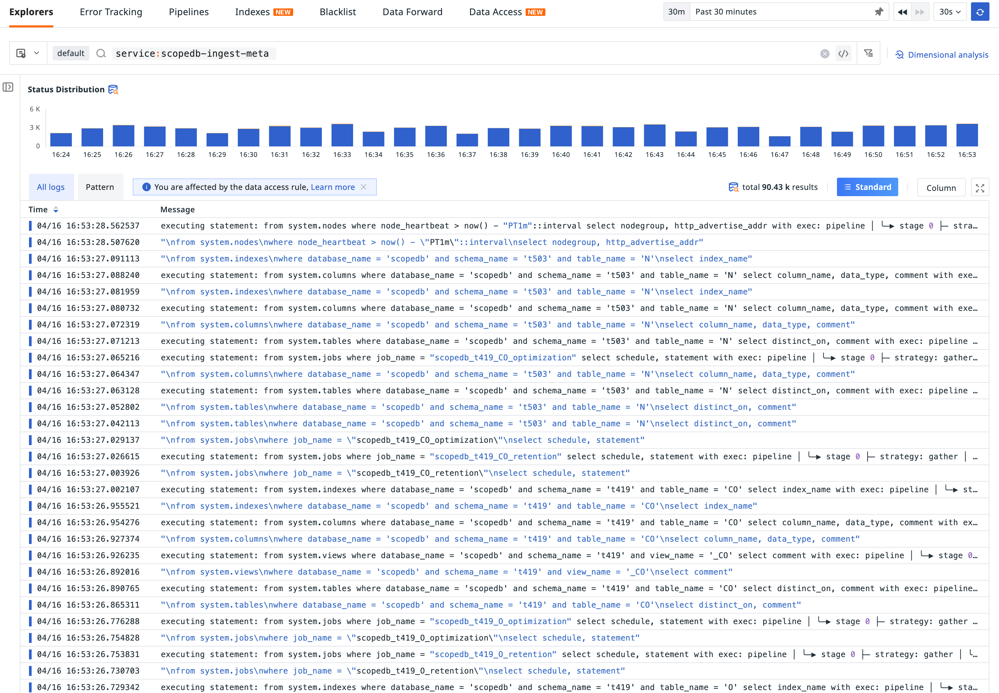
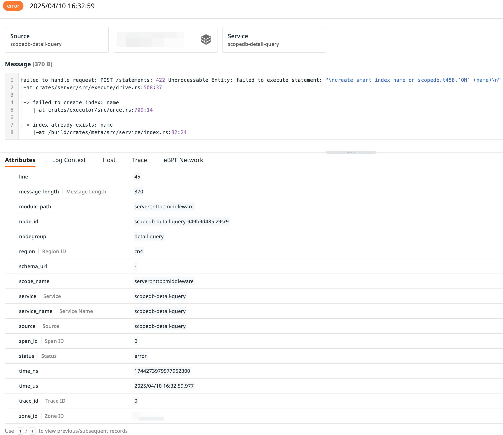
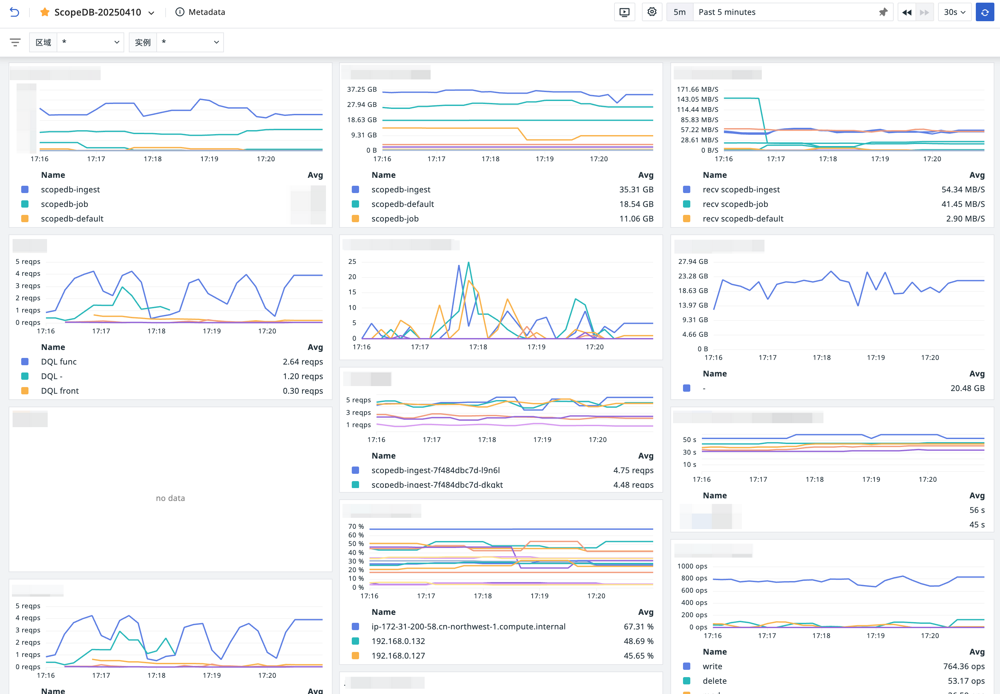

Observability is the ability to measure the internal states of a system by examining its outputs. The three pillars of observability (metrics, logs, and traces) can be used to get insights into system behavior, identify and resolve performance issues to improve system efficiency, and provide responsiveness into complex systems on bottlenecks and failures.

In the [previous introductory](/blog/manage-observability-data-in-petabytes), we discussed how to ScopeDB for managing observability data in petabytes. In this post, we will discuss how we observe ScopeDB, and how the self-observability helps us to evolve ScopeDB into a more reliable and efficient system.

{/* truncate */}

## Traces in ScopeDB

Traces are records that track the path of a request through a system. Traces give us the big picture of what happens when a request is made to ScopeDB.

Here is an example of ScopeDB's query traces:

Traces consist of spans. A span is an individual unit of work done in a system. Each span has a start time, end time, and a set of key-value pairs that provide additional information about the span. Traces work by propagating a unique trace ID, where all spans that are part of the same trace share the same trace ID.

Traces help us identify performance bottlenecks in ScopeDB. For example, if we see that a particular span is taking a long time to complete, we can investigate that span to find out what is causing the delay. By analyzing traces, we have made significant improvements to both IO's and computation's performance.

## Logs in ScopeDB

Logs are detailed, timestamped records of specific events. Logs provide a history of events within ScopeDB, which is critical for debugging.

Here is a sample view of ScopeDB's logs:

ScopeDB can produce structured logs in multiple formats (JSON files, OpenTelemetry logs, etc.). Besides, ScopeDB decorates logs with fruitful metadata. Take the following log record example:

With detailed error logs, we can quickly locate the root cause of problems and fix them.

## Metrics in ScopeDB

Metrics are measurements of a system captured at runtime. Metrics are typically numeric values that are collected over time. They can be used to track the performance of a system, identify trends, and set alerts for specific conditions.

Generally, metrics are collected and displayed in a time-series dashboard:

ScopeDB reports a wide range of metrics, including counters of slow queries, ingestion and its size, gauges of memory usage, pending statements and jobs, histograms of query latencies, and so on. These metrics help us monitor ScopeDB's performance. For example, when the number of slow queries exceeds a certain threshold, an alert will be triggered to notify us.

Even more automatically, we observe the backlog of ingestion requests, scale out ScopeDB when the backlog keeps growing, and scale in when the backlog is cleared. Below is a living example when we auto-scale ScopeDB based on the ingestion backlog metrics:

## Correlating Metrics, Traces, and Logs

To observe a complex distributed system like ScopeDB, we need to correlate metrics, traces, and logs. By correlating these three pillars of observability, we can get a complete picture of what is happening in ScopeDB.

For example, when we see a spike in the number of slow queries in the metrics, we can list slow query logs, and then look into their associated traces. By analyzing the traces, we can identify which spans are taking a long time to complete. We can then look at the attributions or related logs for those spans to find out what is causing the delay. We can also take the workload metrics during the same time into consideration, to see if there is any correlation between the workload and the performance issues.

Properly correlating metrics, traces, and logs requires the system to be instrumented correctly. This is especially challenging for a distributed system, where you need to propagate trace IDs and other metadata across different components.

Currently, ScopeDB leverages OpenTelemetry to instrument its codebase. ScopeDB is written in Rust, and there is no good enough distributed tracing solution at the time of writing. Thus, we developed a complete solution for distributed tracing in Rust, and open-sourced it. You can read more about the solution in this blog post: [_A Modern Approach to Distributed Tracing in Rust_](https://fast.github.io/blog/fastrace-a-modern-approach-to-distributed-tracing-in-rust/).

## Looking Forward: Bootstrapping Self-observability

In the previous introductory, we shared how an observability platform uses ScopeDB to manage metrics, logs, and trace in petabytes. A straightforward question is: can we store ScopeDB's self-observability data in ScopeDB itself? The answer is yes.

The referred observability platform is using ScopeDB for all its observability data, including ScopeDB's self-observability data. To avoid endless recursive events, it's necessary to turn of INFO level logs and traces for data ingestion of ScopeDB. In this way, when self-observability data ingested, it won't generate new events and the recursion will stop.

We're working on a demo on adapting ScopeDB into the OpenTelemetry ecosystem so that you can easily collect telemetry data into ScopeDB with minimal effort, as well as bootstrapping ScopeDB's self-observability. Stay tuned!
