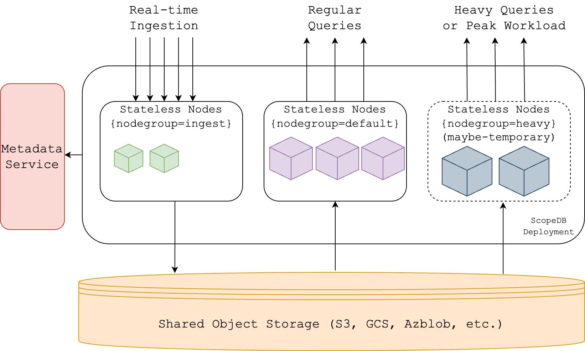

## TL;DR

ScopeDB is a database built directly on top of S3 and unleashes the power of cloud elasticity and workload isolation. ScopeDB servers are launched with a single, stateless Rust binary; thus, it does not need to manage local disks, data sharding, or complex leader election. ScopeDB achieves ten times cost efficiency and performance improvement compared to databases built with shared-nothing architecture by delegating data replication to S3 and dynamically adjusting the number of servers based on the workload.

If you're eager to dive right in, you can try out our playground:

```shell
git clone https://github.com/scopedb/community.git
docker compose -f ./community/playground/docker-compose.yml up -d
docker run -it --rm --entrypoint /bin/scopeql --network host scopedb/scopedb
```

Otherwise, let's begin with the story!

{/* truncate */}

## When Your Observability Data Grows to Petabytes

Here is a story about an observability platform team evolving its data infrastructure to manage the growing volume of observability data.

Observability is the lifeblood of modern software development. It provides insights into the health and performance of applications, infrastructure, and services. As the scale of modern systems grows, so does the volume of observability data generated.

Observability data is typically generated by various sources, such as logs, metrics, and traces. When the data volume is small, it can be stored in a standalone database. However, an observability platform would need to manage observability data at scale, which can grow to petabytes.

For example, an application log entry generally takes 5 to 20 kilobytes. One region of the observability platform that serves thousands of tenants can generate ten billion log entries per day. That's about 100 TB of data per day. So quickly, the platform will need to manage petabytes of data. As the volume of data grows, the platform needs to scale horizontally to handle the increased load.

Since the ELK Stack is a popular solution for logs and traces, the team initially chose _Elasticsearch_ as the backend storage for observability data.

The team had successfully stored logs and traces with Elasticsearch. Elasticsearch provides search capability to support many frequently used queries. However, the data volume keeps growing, and user scenarios have become more and more diverse. The team soon faced several challenges:

* **Cost**: Elasticsearch requires a large number of CPU, memory and local disks to store and query data at scale. The cost of running Elasticsearch clusters can be high.
* **Complexity**: Managing Elasticsearch clusters is hard. Especially, it's incredibly challenging to implement data tiers for offloading cold data in the real world.
* **Limited Analysis**: Search is not the only requirement for querying data. The team received requirements for aggregation and multi-dimension analysis. Elasticsearch is not designed for these complex analytical queries: poor indexing support, no columnar data format, and no vectorized query engine.

Although Elasticsearch works well on search queries, a general-purpose search engine is too expensive for log data. Considering the cost, complexity, and limited analysis, the team decided to explore other solutions.

In recent years, platform engineers have been exploring _data warehouse_ solutions for observability data. A famous column-oriented data warehouse has been gaining popularity as an observability data solution for cutting costs and supporting aggregations.

The team built a proof of concept for this data warehouse solution. It showed promising results that the storage cost was reduced by 70% thanks to the compact columnar data format. Meanwhile, running aggregations on single big tables was fast by fine-tuning the configuration.

However, before the team could roll out the data warehouse solution to production, they encountered new challenges:

* **Data Ingestion**: The data warehouse solution was not designed for real-time data ingestion. The team had to build a custom ETL pipeline to ingest data into the warehouse.
* **Stateful Scaling**: The data warehouse solution employs a shared-nothing architecture, meaning the team had to manage data replication, data sharding, and leader election. You can hardly temporarily add new nodes to the cluster to handle peak workloads.
* **Rigid Schema**: The data warehouse solution requires a prior schema definition for each table. While the schema of observability data often evolves quickly and unpredictably with new fields and dimensions, it's impossible to define a fixed schema in advance.

Instead of jumping into solving these challenges from the platform side, the team decided to look around for other solutions that could better fit the observability data use case.

## Cloud Services Make Differences

Prior to building ScopeDB, we have been developing databases for over ten years. We built distributed databases with shared-nothing architecture. They work well when deployed on bare-metal servers. However, when deployed in the cloud, many essential assumptions are broken.

Local disks are necessary for shared-nothing databases. However, the only available commodity block device in the cloud is EBS, which is more than expensive when storing petabytes of data. Even one petabyte of EBS storage costs \$80,000 to \$125,000 per month.

In contrast, object storage can provide a much more cost-effective solution. As a comparison, storing one petabyte of data on S3 costs \$21,550 per month. Considering the price difference of IOPS and throughput, the cost of EBS can be ten times higher than S3. In the meantime, S3 still provides competitive reliability, scalability, and elasticity.

Therefore, databases in the cloud should move from local disks to object storage, which would mean a paradigm shift from shared-nothing to shared-disk.

Existing shared-nothing databases may develop tiered storage to offload cold data to object storage. Nevertheless, local disks are still required for primary data storage. Data replication, sharding, and leader election are also still needed to run basic operations and queries.

Besides, in the cloud, you can dynamically scale out and scale in the number of nodes based on the workload. Each node can have different sizes and instance types; AWS EC2 provides a wide range of instance types. It's possible to design a database that serves ingestion with small, general-purpose instances and serves queries with large, memory-optimized instances. What's more, to handle heavy queries isolated from general queries, you can temporarily scale out new nodes and perhaps leverage spot instances for a better cost.

Unfortunately, shared-nothing databases use stateful nodes. Each node needs to handle part of data partitions for both its reads and writes (ingest or replicate). They are not designed for workload isolation. You have to select an instance type that satisfies all workloads, which always wastes resources.

We met the observability platform team and discussed the challenges they faced. We agreed that patching a shared-nothing database in the cloud is a waste of time. Instead, a database designed from the ground up around commodity object storage could naturally eliminate the issues of total cost and stateful scaling. With additional features to support observability data that have a flexible schema, we could provide a better solution for the platform.

ScopeDB is our product implementing this idea. Currently, it serves all the workload of the observability platform.

## Introducing ScopeDB

ScopeDB is a columnar database that runs directly on top of any commodity object storage. It is designed explicitly for data workloads with massive writes, any-scale reads, and flexible schema. These are the fundamental characteristics of observability data.

Let's start with a glance at the architecture of ScopeDB:



## Real-time Ingestion

By getting rid of stateful nodes, ScopeDB deployments can have different nodegroups for different workloads. Each nodegroup can have a different number of stateless nodes with varying types of instances, unleashing the power of workload isolation.

The `ingest` nodegroup illustrates a typical setup for real-time ingestion, with two nodes of small, general-purpose instances.

The ingest API is as simple as one HTTP POST request:

```shell
curl -X POST -H 'Content-Type: application/json' http://ingest-node:6543/v1/ingest -d @- <<EOF
{
  "data": {
    "format": "json",
    "rows": "<json-lines>"
  },
  "statement": "INSERT INTO scopedb.tenant.logs"
}
EOF
```

As it's a one-shot, stateless request, ingest nodes can handle massive ingestion requests independently. The data will be decoded into the internal table format and written directly into S3. No local disks or data replication are needed.

Data compaction happens in the background. So, even if you frequently ingest data in small sets, the background task will compact them into larger files to reduce the cost of S3 storage and improve the query performance.

## Any-scale Analysis

Here are several query examples that ScopeDB can handle:

```scopeql
FROM scopedb.tenant.logs
WHERE regexp_like(http_url, ".*webhooks.*")
  AND host = "cratesland"
  AND time >= now() - "PT24h"::interval
  AND time < now()
GROUP BY source
AGGREGATE max(time) as time, count(true);

FROM scopedb.tenant.logs
WHERE time >= now() - "PT15m"::interval
  AND time < now()
  AND search(message, "media")
  AND search(message, "external")
ORDER BY time DESC
LIMIT 100;
```

ScopeDB has a SQL-like query language called ScopeQL. It supports a wide range of analytical queries and is specifically designed for observability analysis.

For example, the platform team initially used Elasticsearch as their data store, which provides powerful search capabilities. ScopeDB supports similar complex filters to cover all the existing user scenarios. Users can filter with time range, text match, regular expression, label match, condition with functions, and more. Aggregation is another powerful functionality to get insights from observability data, while Elasticsearch's support is limited. Except for the basic count, sum, min, and max, ScopeDB supports advanced aggregation functions like top-k, percentile, and standard deviation.

Performance is significant for executing queries with data at any scale. The primary performance factor is minimizing the data scanned. Especially when the data is stored in S3, you'd want to read as few objects as possible. ScopeDB can create various indexes on columns. Combined with pushdown filters and real-time data distribution, ScopeDB can significantly reduce the amount of data scanned.

Moreover, ScopeDB stores data in a columnar format, which means it only reads the columns needed for the query. This is desired for most analytical queries, as they usually only need a few columns. ScopeDB's query engine is a vectorized query engine that processes multiple rows in a batch, further unleashing the benefit of the columnar data format.

When performing aggregation on high-cardinality fields, one single node may not be able to handle the entire workload. Thanks to ScopeDB's distributed query engine, we can scale out the query to multiple nodes. The query engine will distribute the workload to multiple nodes and merge the results in parallel. This not only makes running heavy queries possible but also accelerates queries in general.

Back to the architecture diagram, there are both `default` and `heavy` nodegroups. The `default` nodegroup is a long-running nodegroup for general queries. When a heavy query comes in (often an ad-hoc query), the deployment can temporarily scale out a new nodegroup (`heavy`) to handle the query, and then scale in after the query is done. In this way, heavy queries won't affect the performance of general queries.

## Flexible Data Schema

Observability data often has a flexible schema. Take logs as an example. No matter it is a structured log (application logs) or a plain text log (access logs), the platform can normalize them into a semi-structured format, such as JSON:

```json
{
  "timestamp": "2025-01-22T03:20:15.506432Z",
  "severity": "INFO",
  "message": "User login successful",
  "user_id": 108848,
  "ip_address": "192.168.1.100",
  "application": "WebApp",
  "log_type": "authentication",
  "location": "LoginController",
  "server": "WebServer-01"
}
```

While access logs may only evolve format occasionally, application logs can have new fields added every day. It's impossible to define a fixed schema for all logs in advance.

Instead, databases for observability data should support variant data type. ScopeDB can parse JSON string into a variant value:

```scopeql
VALUES
  (1, 'null'),
  (2, NULL),
  (3, 'true'),
  (4, '-17'),
  (5, '123.12'),
  (6, '1.912e2'),
  (7, '"Om ara pa ca na dhih"  '),
  (8, '[-1, 12, 289, 2188, false]'),
  (9, '{ "x" : "abc", "y" : false, "z": 10} '),
SELECT $0 AS n, parse_json($1) AS v,
SELECT n, v, typeof(v),
ORDER BY n
```

It outputs:

```
+---+------------------------------+-----------+
| n | v                            | typeof(v) |
+---+------------------------------+-----------+
| 1 | null                         | null      |
| 2 | NULL                         | NULL      |
| 3 | true                         | boolean   |
| 4 | -17                          | int       |
| 5 | 123.12                       | float     |
| 6 | 191.2                        | float     |
| 7 | 'Om ara pa ca na dhih'       | string    |
| 8 | [-1,12,289,2188,false]       | array     |
| 9 | {"x":'abc',"y":false,"z":10} | object    |
+---+------------------------------+-----------+
```

In case some log fields are fixed and frequently queried, the observability platform can define a table with both fixed fields and variant fields. The fixed fields are stored in separate columns, and users can create indexes on them to accelerate the query. Here is an example of log tables:

```scopeql
CREATE TABLE scopedb.tenant.logs (
  time timestamp,
  container_id string,
  container_name string,
  container_runtime_name string,
  container_type string,
  filename string,
  filepath string,
  host string,
  message string,
  message_length int,
  name string,
  source string,
  status string,
  var variant,
);
```

The `time` column is primarily used for filtering and sorting. The `var` column stores the original log message as a variant value. Other columns are tags extracted from the log message. Users can then create index on `time` and tags to accelerate the query.

For querying over variant data, ScopeDB provides a set of functions to extract, cast, and compare variant values:

```scopeql
FROM scopedb.tenant.logs
WHERE var["meta"]["peer.hostname"]::string = "192.128.10.75"
  AND time >= now() - "PT6h"::interval
  AND time < now()
GROUP BY source
AGGREGATE max(time) as time, count(true);
```

## Looking Forward

We've nearly reached the end, and some of you may be disappointed that we omit many details of ScopeDB's features and implementation, such as how to handle the metadata, how the distributed query engine works, and more demos to work with variant data.

We'll talk about that more in future blog posts; stay tuned!

If you just want to get your hands dirty, you can try out our playground:

```shell
git clone https://github.com/scopedb/community.git
docker compose -f ./community/playground/docker-compose.yml up -d
docker run -it --rm --entrypoint /bin/scopeql --network host scopedb/scopedb
```
