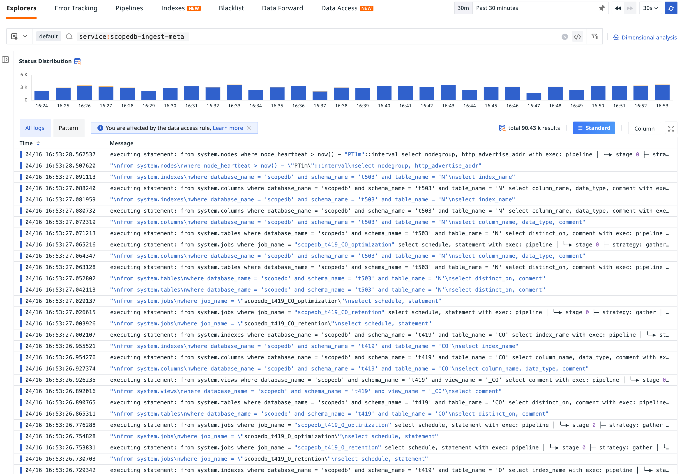

Observability is the ability to measure the internal states of a system by examining its outputs. The three pillars of observability (metrics, logs, and traces) can be used to get insights into system behavior, identify and resolve performance issues to improve system efficiency, and provide responsiveness into complex systems on bottlenecks and failures.

In the [previous introduction](/blog/manage-observability-data-in-petabytes), we explored how ScopeDB can be used to store and manage observability data at a petabyte scale. In this post, we will discuss how we observe ScopeDB and how its self-observability helps us evolve it into a more reliable and efficient system.

{/* truncate */}

## Traces in ScopeDB

Traces are records that help track the path of a request through a system. Traces offer an overview of what happens when a request is made to ScopeDB.

Here is an example of ScopeDB's query traces:

Traces are made up of spans, where each span represents a single unit of work performed with the system. Each span has a start time, end time, and a set of key-value pairs that provide additional information about the span. Traces work by propagating a unique trace ID, where all spans that are part of the same trace share the same trace ID.

With traces, we can identify performance bottlenecks in ScopeDB more effectively. For example, if a particular span takes longer to complete, we can quickly identify the bottleneck by examining the span and tracing the source of the delay. By analyzing traces, we have made dozens of significant improvements to both I/O and computational performance.

## Logs in ScopeDB

Logs are detailed, timestamped records of specific events. Logs provide a history of events within ScopeDB, which is critical for debugging.

Here is a sample view of ScopeDB's logs:

ScopeDB is designed to be able to produce structured logs in a variety of common formats(JSON, OpenTelemetry logs, etc.). Additionally, ScopeDB enriches logs with fruitful metadata. Check the following log record example:

With detailed error logs, we can quickly locate the root cause of problems and fix them.

## Metrics in ScopeDB

Metrics are runtime measurements of a system, typically represented as numeric values collected over time.They can be used to track system performance, identify trends, and set alerts for specific conditions.

Generally, metrics are collected as time-series data and displayed with dashboards:

ScopeDB reports a wide range of metrics, including counters of numbers of slow queries, ingestion requests and their sizes over time, gauges of memory usage, numbers of pending statements and jobs, and histograms of query latencies. These metrics help us understand ScopeDB's performance and set up effective monitoring. For example, we can set up an alert to notify us when the number of slow queries over the past 5 minutes exceeds a certain threshold.

And that's just the beginning: metrics also enable auto-scaling by triggering scale-in and scale-out actions based on the backlog of ingestion requests. Here's a real-world example of ScopeDB automatically scaling based on ingestion backlog metrics:

When the ingestion backlog grows, we temporarily instantiate additional nodes of the "scopedb-ingest" nodegroup to consume the backlog. And once the backlog gets consumed, those additional nodes are shutting down.

## Correlating Metrics, Traces, and Logs

To observe a complex distributed system like ScopeDB, we need to correlate metrics, traces, and logs. By correlating all three pillars of observability, we are able to get a complete picture of what is happening in ScopeDB.

For example, when there is a spike in the number of slow queries in the metrics, we can list the slow query logs and then look into the associated traces. By analyzing the traces, we'll know which spans are taking longer to complete. Then, we could look at the attributes or related logs of these spans to find out the reason for the delay. Additionally, it is possible to take the workload metrics during the same period into consideration, and see if there is any correlation between workload and performance issues.

However, to properly correlate metrics, traces, and logs of a system, it requires that the system be instrumented correctly. This is especially challenging in a distributed system, where trace IDs and other metadata can be propagated across various components.

Currently, ScopeDB leverages OpenTelemetry to instrument its codebase. ScopeDB is written in Rust, but at the time of writing, there isn't a sufficiently mature distributed tracing solution available. Thus, we developed a complete solution for distributed tracing in Rust and open-sourced it. Read more about the solution in this blog post: [_A Modern Approach to Distributed Tracing in Rust_](https://fast.github.io/blog/fastrace-a-modern-approach-to-distributed-tracing-in-rust/).

## Looking Forward: Bootstrapping Self-observability

In the previous introduction, we explored how an observability platform uses ScopeDB to store and manage metrics, logs, and traces at a petabyte scale. A natural question then arises: Can ScopeDB store its self-observability data? Surely, the answer is YES!

The observability platform is using ScopeDB for all its observability data, including ScopeDB's self-observability data. To avoid endless recursive events, it's necessary to turn off INFO level logs and traces for data ingestion of ScopeDB. In this way, when self-observability data ingested, it won't generate new events and the recursion will stop.

We're working on a demo on adapting ScopeDB into the OpenTelemetry ecosystem so that you can easily collect telemetry data into ScopeDB with minimal effort, as well as bootstrapping ScopeDB's self-observability. Stay tuned!
